# Nota Nobile: 
Welcome to the Nota Nobile Restaurant website! This repository contains the source code for our elegant and interactive dining platform, designed to showcase the culinary excellence of Italy.
# Technologies: 
Python, Django, PosgreSQl, Boostrap, Materialize, S3 Aws
# Features:
## Signup:
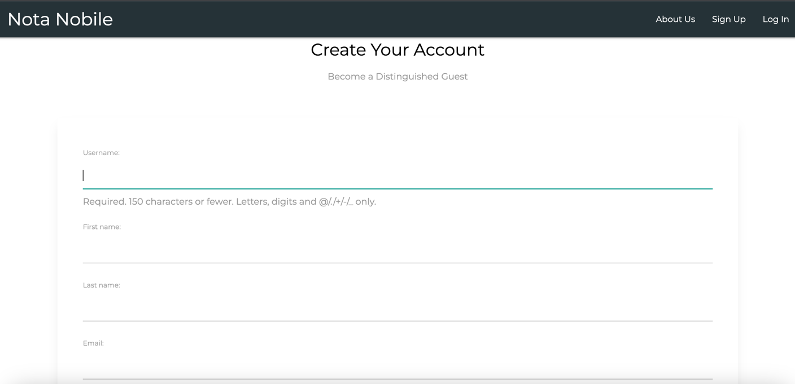
## Login:
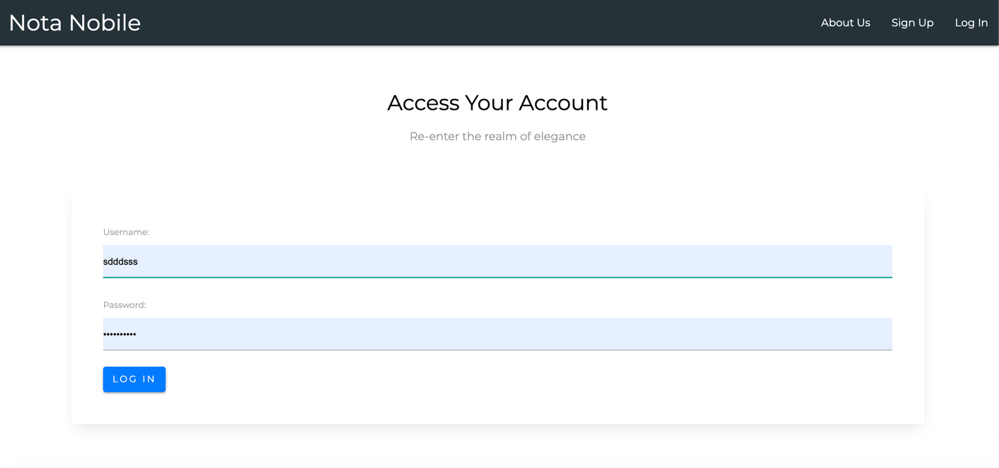
Login as a Customer user: 
Navbar will show: 
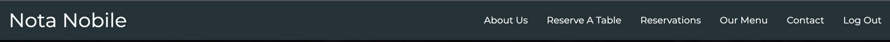
## Homepage: 
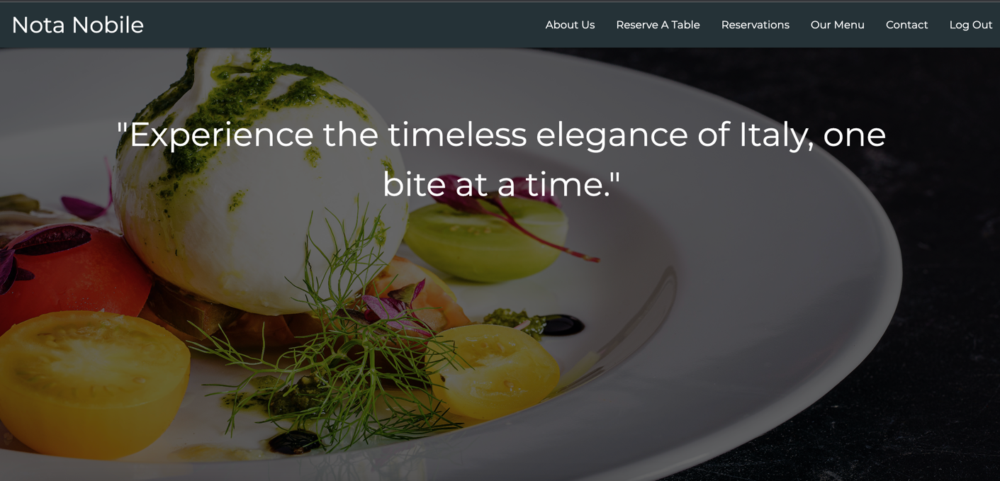
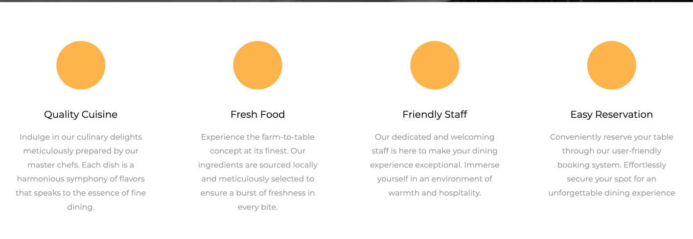

## About us page:
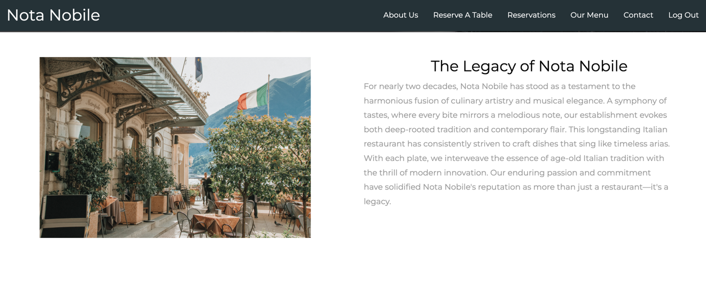
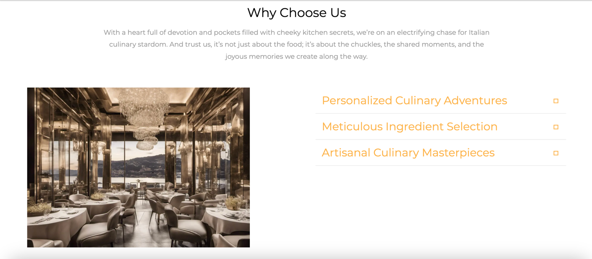
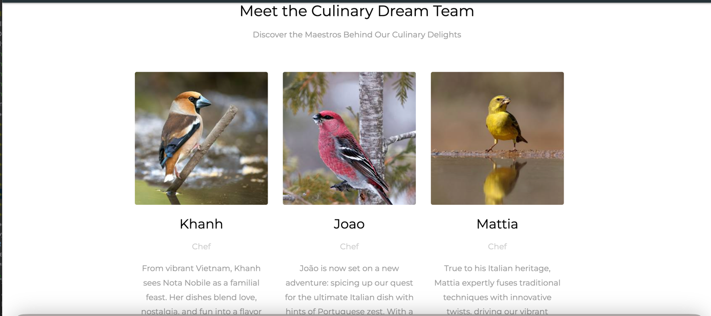
## Reserve a Table:
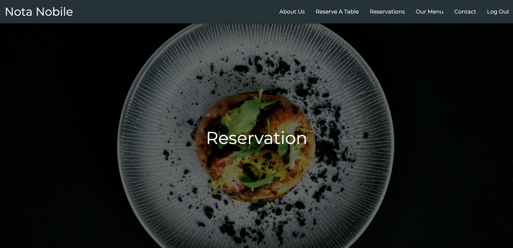
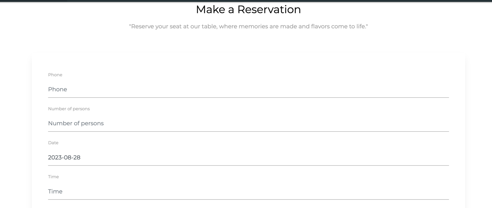
## Reservations
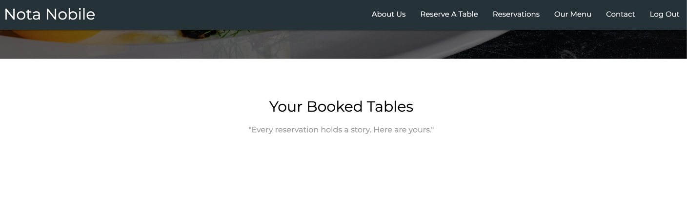
## Our Menu:
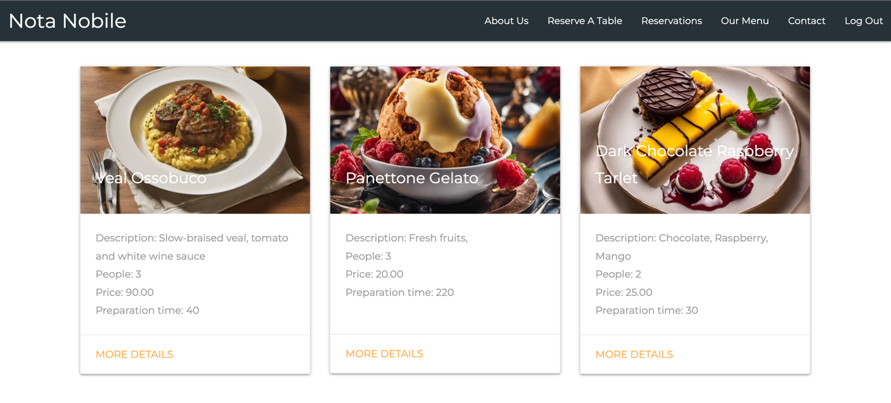
## Meal details page:
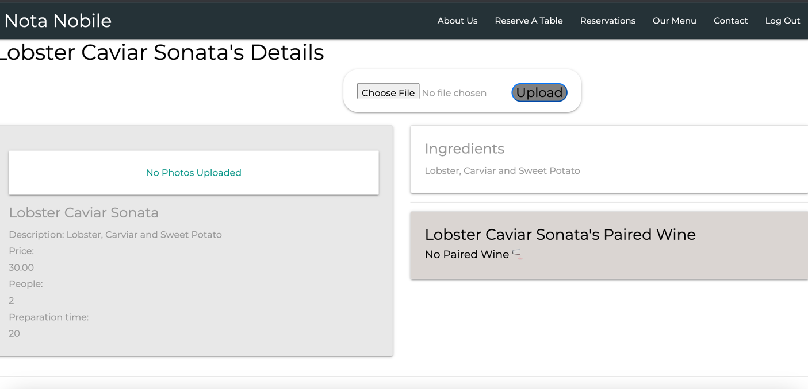
## Contact:
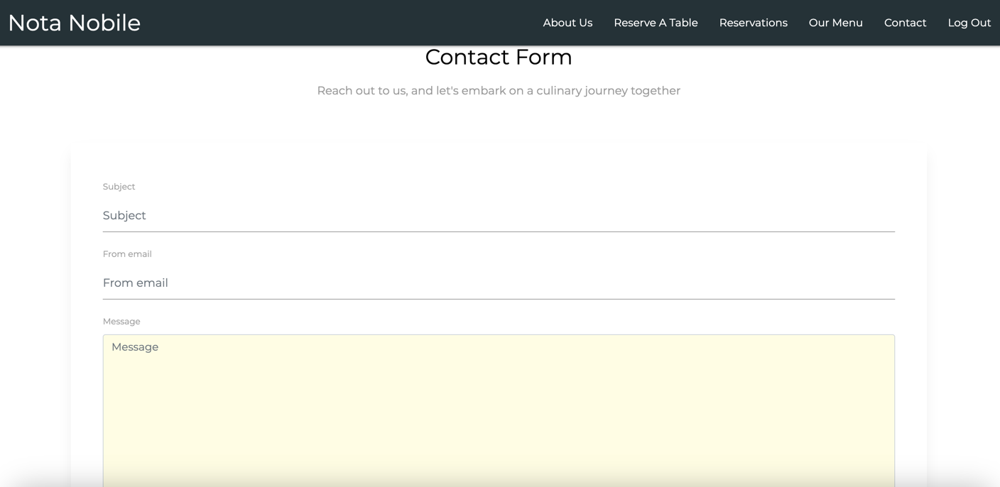
## Login as an Admin(staff): 
Navbar will show: 
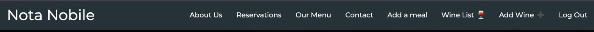
## Link:
[notanobile](https://notanobilekhanh.fly.dev/meals/)

[Trello](https://trello.com/b/bGo59KtF/nota-nobile)
## Next Steps
Plans for the future:
* Add a blog
* Re-format the meal card under Our Menu title
* Develop on mobile app
* Create the social media icons with links
