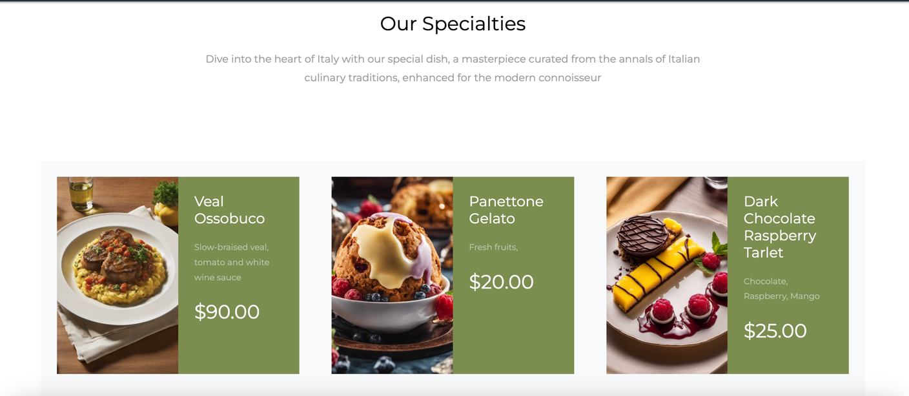

# Nota Nobile: 
Welcome to the Nota Nobile Restaurant website! This repository contains the source code for our elegant and interactive dining platform, designed to showcase the culinary excellence of Italy.
# Features:
* About Us: Discover the essence of our restaurant through the "About Us" 
section. Learn about our values, history, and dedication to culinary artistry.
* Why Choose Us: Uncover the reasons that set Nota Nobile apart. Explore our 
unique offerings and the philosophy that drives our commitment to 
excellence.
* Culinary Dream Team: Meet the talented chefs who bring the flavors of Italy 
to life. Learn about their expertise, backgrounds, and contributions to our 
culinary creations.
* Menu Showcase: Immerse yourself in our carefully crafted menu. From 
quality cuisine to farm-to-table freshness, our menu items are meticulously 
prepared to provide a harmonious symphony of flavors.
*Wine Pairing: Elevate your dining experience with our wine pairing feature. 
Discover the perfect complement to your selected dishes.
* Reservation System: Conveniently reserve your table through our user-
friendly booking system. Secure your spot for an unforgettable dining 
experience.
* User Roles: We offer distinct user types, including admin and customer roles. 
Admin users have special privileges for managing content, while customer 
users can explore and engage with the website.
* Navigate through the various sections to learn more about us, our 
specialties, and the culinary team.
# Technologies: 
Python, Django, PosgreSQl, Boostrap, Materialize, S3 Aws
## Signup:

## Login:

Login as a Customer user: 
Navbar will show: 

## Homepage: 

## About us page:

## Reserve a Table:

## Reservations

## Our Menu:

## Meal details page:

## Contact:

## Login as an Admin(staff): 
Navbar will show: 

## Links:
[notanobile](https://notanobilekhanh.fly.dev/meals/)

[Trello](https://trello.com/b/bGo59KtF/nota-nobile)
## Next Steps
Plans for the future:
* Add a blog
* Re-format the meal card under Our Menu title
* Develop on mobile app
* Create the social media icons with links
